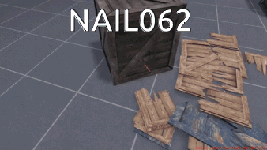

## Vypracované otázky na logiku

Zpracováno v lednu 2026. Určeno k předmětu [NAIL062 Výroková a predikátová logika](https://jbulin.github.io/teaching/fall/nail062/) na MFF UK.

### Vývoj
- VS Code, extension Tinymist Typst, otevřít `otazky.typ`, vpravo nahoře Open Preview, náhled se bude aktualizovat živě
- pokud nechcete instalovat VS Code: nainstalovat Typst (na Archi balíček [typst](https://archlinux.org/packages/extra/x86_64/typst/), na horších distrech [nějak manuálně](https://typst.app/open-source/#download)), v terminálu `typst watch otazky.typ`

### Já když když

